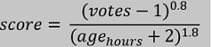

## Hacker News Rankings for Mainframe/COBOL Posts

We will explore the popular Hacker News website for this challenge. Hacker News is an online community started by Paul Graham for sharing "Anything that good hackers would find interesting. That includes more than hacking and startups".

### A little Background 
The site offers a dynamic list of posts/stories, submitted by users, each of which could be expanded into its own unique comment thread. Readers can upvote or downvote links and comments, and the top thirty links are featured on the front page. Today, more than five million people read Hacker News each month, and landing a blog post on the front page is a badge of honor for many technologists.

### Our Goal
We will be working on a Hacker News 2015-2016 dataset from Kaggle with a full year’s worth of stories:  Our goal is to extract only the Mainframe/COBOL related stories and assign ranking scores to them based on (a simplified version) the published Hacker News ranking algorithm. We will create a front page report that reflects this ranking order. The algorithm works in a way that nothing stays on the front page for too long, so a story’s score will eventually drop to zero over time (the gravity effect). Since our posts are spread out over a year and as older posts will always have a lower (or zero) ranking, we will distort the data so all our stories have the same date and and consider only the times in the ranking score calculation. This will give all our posts a fair chance of landing the front page.  Our front page report is published at 11:59pm. [Here's some additional information on the ranking.](http://www.righto.com/2013/11/how-hacker-news-ranking-really-works.html)

### The plan
 [] There are different creative ways of accomplishing this but here’s our plan: We will have a COBOL program that reads the input CSV file and retrieves only the ***Mainframe/COBOL*** stories. It then calculates the ranking score for the stories by factoring in the time they were posted and the number of votes they received. Each of the records is then written to an output dataset along with the ranking score. 

 [] We will then use `DFSORT` to sort the output dataset on ranking score, highest to lowest and display the posts as a simple report mimicking the front page. 
 
 Let's get started!
 1. [Download the dataset (around 300,000 rows) as a CSV file](https://www.kaggle.com/hacker-news/hacker-news-posts)
 

  2. Clean up the file: Remove the `URL` column as this has no relevance for us and takes up a lot of bytes. Find the maximum length of each of the remaining columns. 
 
 3.	Create a sequential Dataset (with record length based on the sum total of all the maximum column lengths) on the Mainframe making sure you allocate sufficient space as this is a considerably large file. Upload the CSV file to this dataset. Both of the above can be done with `Zowe CLI files` commands. (Enter `Zowe files –hw` in the terminal to bring up browser based help)
 

 4.	Create your COBOL program in `<userid>.CBL` in the Code4z editor – This program will :
      1. Read in each record in the input CSV file
      2. Select only the records that have mention of the words ***Mainframe*** or ***COBOL*** (ignore case) in the `Title` field
      3. Calculate the ranking score for each record based on the number of votes it received and the time it was posted (Ignore date as we assume all posts were created on the same date)
          
          
      4. Write the record to an output file along with the ranking score
      
      
5. Copy/Modify/Create a JCL in `<userid>.JCL` for compiling/linking and running the program against input/output datasets.

6. Submit the job (via `Zowe Explorer` or `Zowe CLI`), debug and test to create the output dataset.

7. Next add a new step in the JCL member to run the `DFSORT` utility on the output dataset from the previous step. The sort should be done on the ranking score field, from highest to lowest. Use `DFSORT` to also print headers for our front page. As this is a new utility not covered in the course, please check out these links to explore this very powerful and versatile tool:
 
[Getting started with DFSORT](https://www-01.ibm.com/servers/resourcelink/svc00100.nsf/pages/zOSV2R3sc236880/$file/iceg200_v2r3.pdf)

[Example with DFSORT](https://www.ibm.com/support/knowledgecenter/en/SSLTBW_2.1.0/com.ibm.zos.v2r1.icea100/ice2ca_Example_10._Sort_with_OUTFIL.htm)

8. Run and debug until the front page looks ready! Which posts ranked among the highest? Here's a look at the generated report:

Happy COBOL coding!

